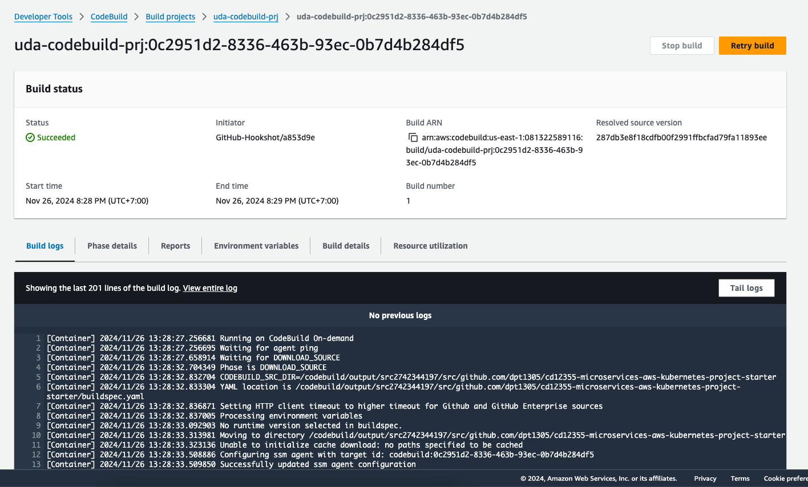
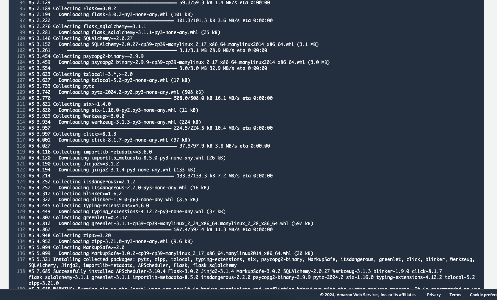
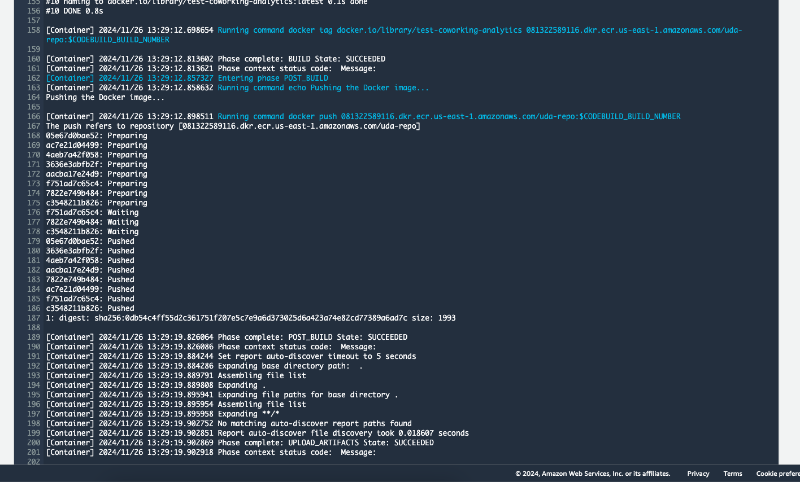
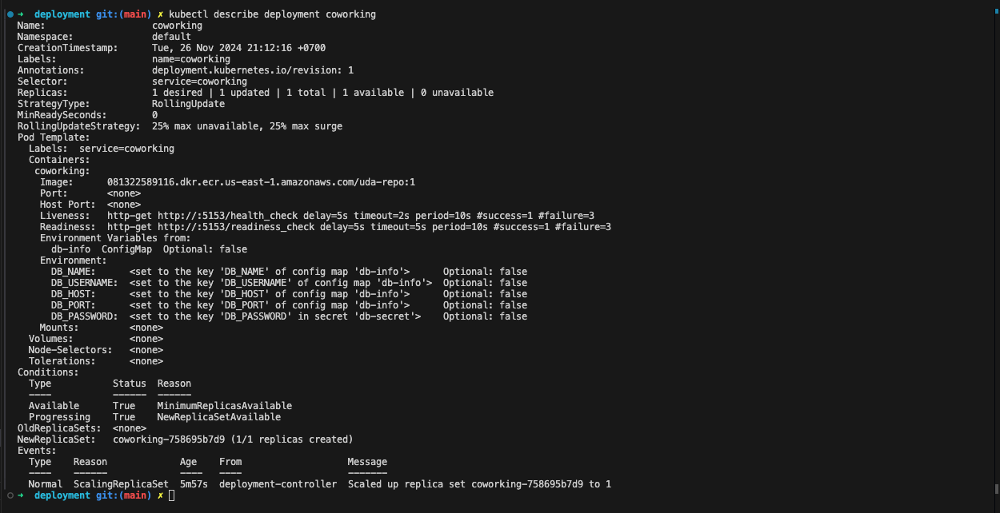
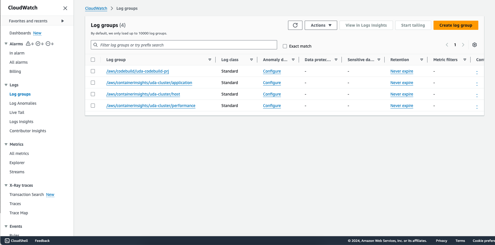

## Set up cluster
> ./commands/create-cluster.sh

## Set up database and application 
> ./commands/create-db&app.sh

## Set up CodeBuild project
> ./commands/create-codebuild-project.sh

## Set up ECR repository
> ./commands/create-ecr.sh

## Result
1. CodeBuild pipeline logs:







2. ECR image


3. Run ```kubectl get pods```


4. Run ```kubectl describe svc postgresql-service```


5. Run ```kubectl describe deployment coworking``


6. CloudWatch logs:


